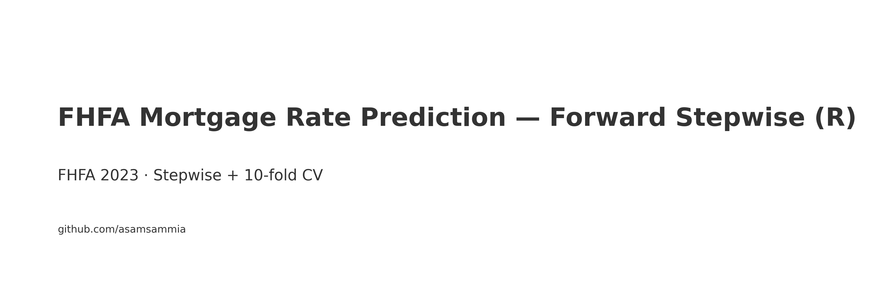
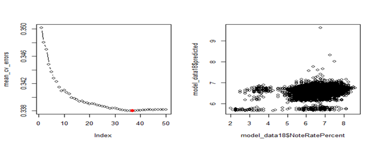
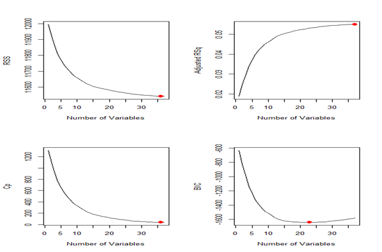
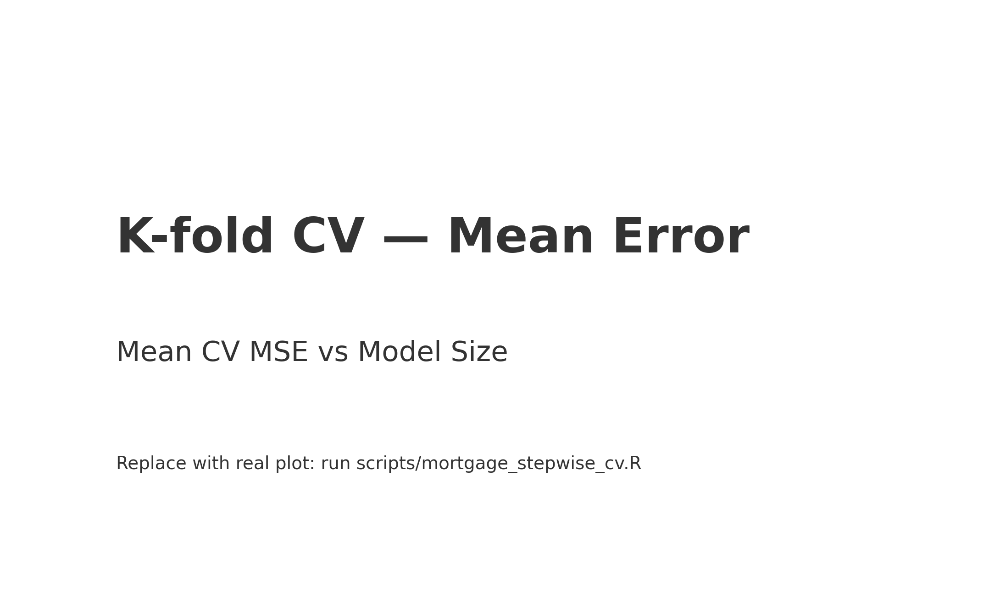
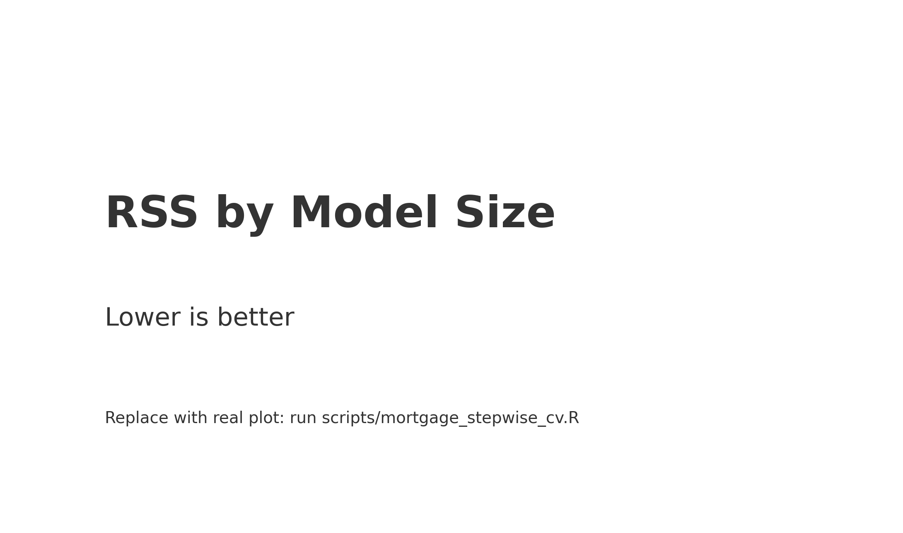
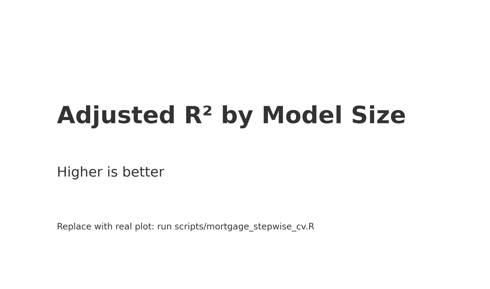
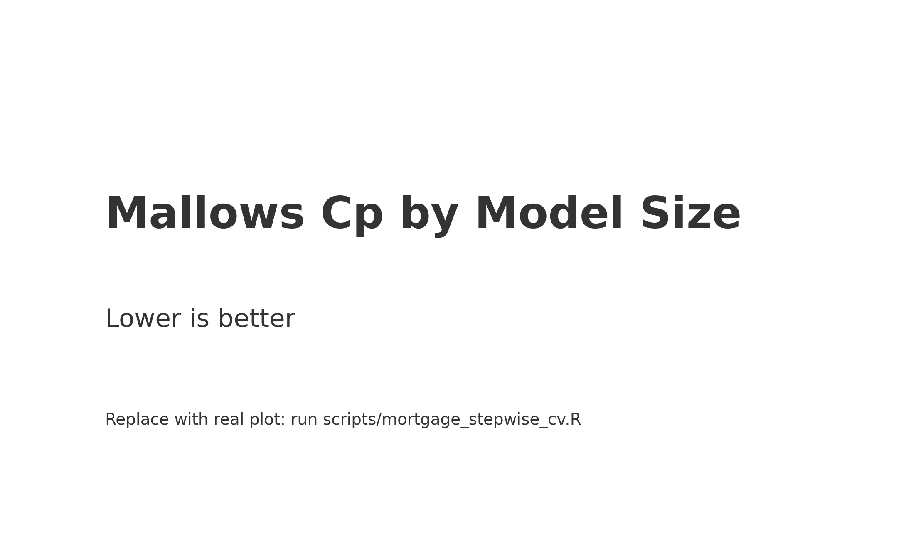
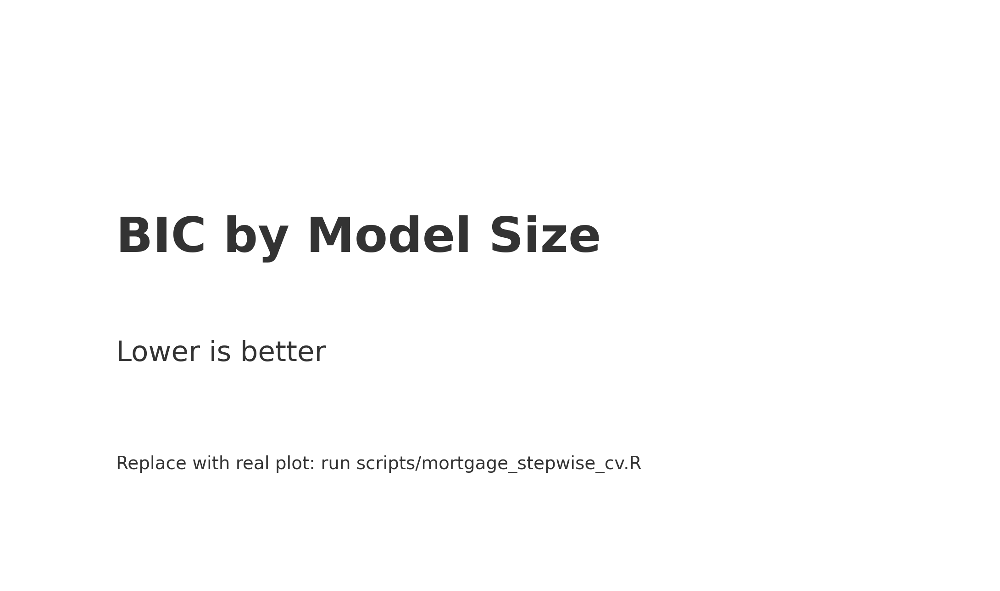
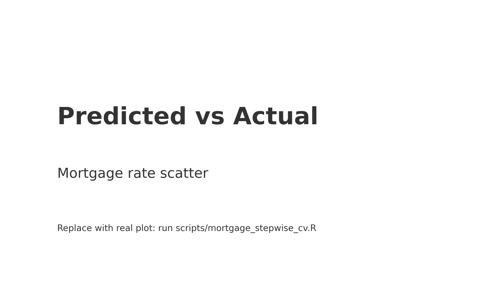

# Mortgage Rate Prediction (FHFA 2023)

Predicts mortgage note rates from borrower + loan attributes with **forward subset selection** and **10-fold cross-validation**. Reproducible, CI-ready R project.

**Why it matters**
- **Pricing:** benchmark expected note rate by borrower/loan profile  
- **Underwriting:** sanity-check quoted rates against a transparent baseline  
- **Scenarioing:** see impact of income, PMI/LTV, credit score, or state effects

**Stack:** R (leaps, boot, dplyr, readxl, jsonlite) · Scripts + assets + CI

## Quickstart
```r
# install
pkgs <- c("optparse","leaps","boot","readxl","dplyr","jsonlite")
to_install <- pkgs[!pkgs %in% rownames(installed.packages())]
if (length(to_install)) install.packages(to_install, repos="https://cloud.r-project.org")

# demo (generates sample data and plots)
Rscript scripts/demo.R
```

## What’s in this repo
- `scripts/mortgage_stepwise_cv.R` – train + K-fold CV + plots + coef export  
- `scripts/mortgage_apply.R` – apply saved coefficients to new data  
- `assets/` – images used in README (tracked)  
- `outputs/` – run artifacts (git-ignored)

---

## Results (snapshot)
| Metric | Value |
|---|---|
| Samples evaluated | **34,273** |
| Correlation (actual vs predicted) | **0.2334** |
| RMSE | **0.5808** |
| MSE | **0.3373** |
| MAE | **0.4476** |

*Figures below show CV error by model size and diagnostics (RSS, Adj-R², Cp, BIC).*


## How to Cite
**APA (suggested):**  
Samih, A. (2025). *FHFA Mortgage Rate Prediction — Forward Stepwise (R)*. GitHub repository. https://github.com/asamsammia/fhfa-mortgage-stepwise-R

**BibTeX:**
```bibtex
@software{Samih2025-fhfa-mortgage-stepwise-R,
  author  = {Abdul Samih},
  title   = {FHFA Mortgage Rate Prediction — Forward Stepwise (R)},
  year    = {2025},
  url     = {https://github.com/asamsammia/fhfa-mortgage-stepwise-R}
}
```

## Limitations
- **Subset selection instability:** Forward best-subsets can be sensitive to small data changes.
- **Omitted macro factors:** No explicit macroeconomic controls (e.g., CPI, Fed Funds) are modeled.
- **Linear structure:** The baseline is linear; non‑linearities/interactions may be underfit.
- **Encoding:** `state` and credit score are factor-encoded; alternative encodings may shift coefficients.
- **CV randomness:** 10‑fold assignment introduces variance; set a seed to replicate.

---

---

## Your Actual Plots

<table>
  <tr>
    <td></td>
  </tr>
  <tr>
    <td></td>
  </tr>
</table>

## Key Plots

<table>
  <tr>
    <td></td>
    <td></td>
  </tr>
  <tr>
    <td></td>
    <td></td>
  </tr>
  <tr>
    <td></td>
    <td></td>
  </tr>
</table>

**Note:** These are placeholders. To publish your real figures:
```bash
Rscript scripts/mortgage_stepwise_cv.R --input data/2023-pudb.xlsx --sheet 1
mv outputs/*.png assets/   # overwrite placeholders
git add assets/*.png
git commit -m "docs: add real plots"
git push
```